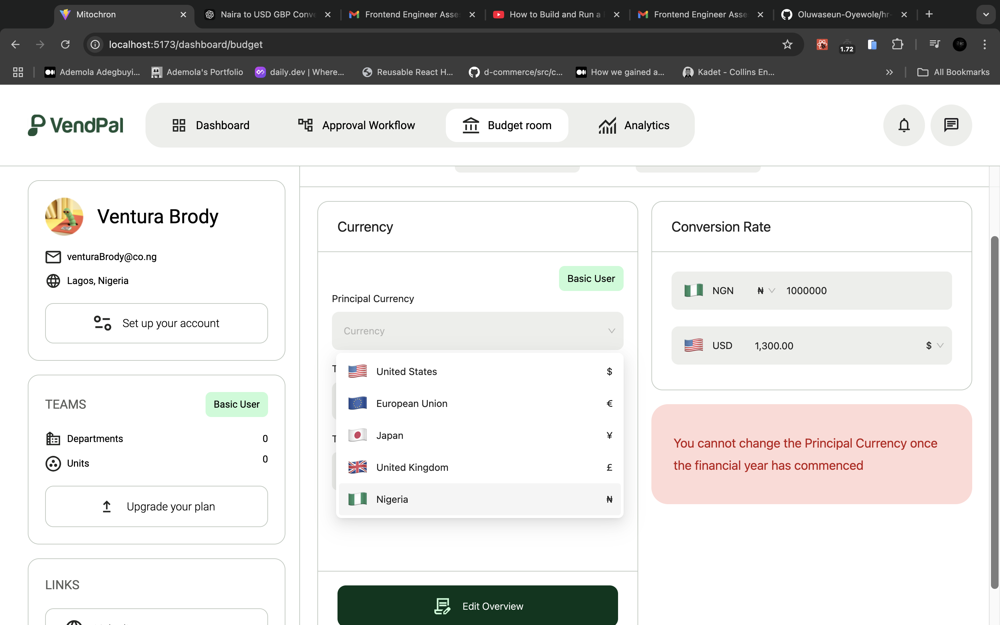
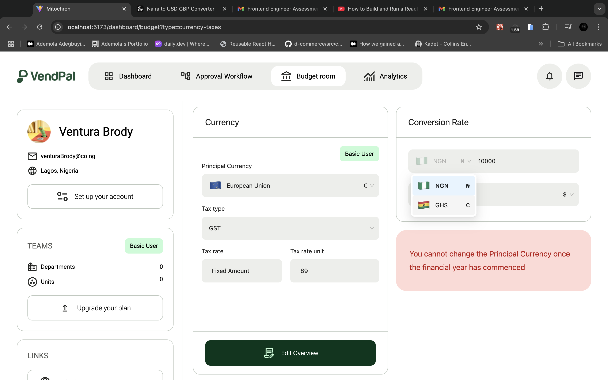
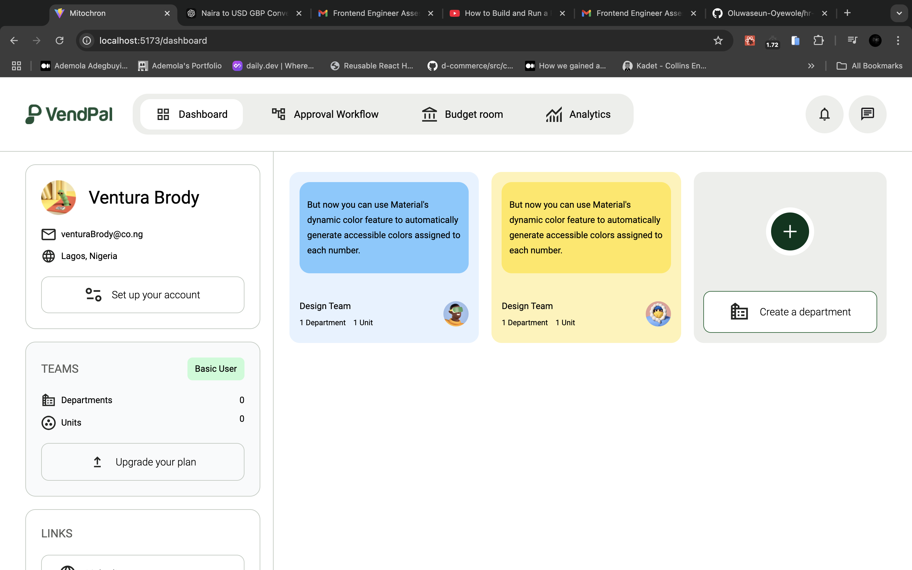
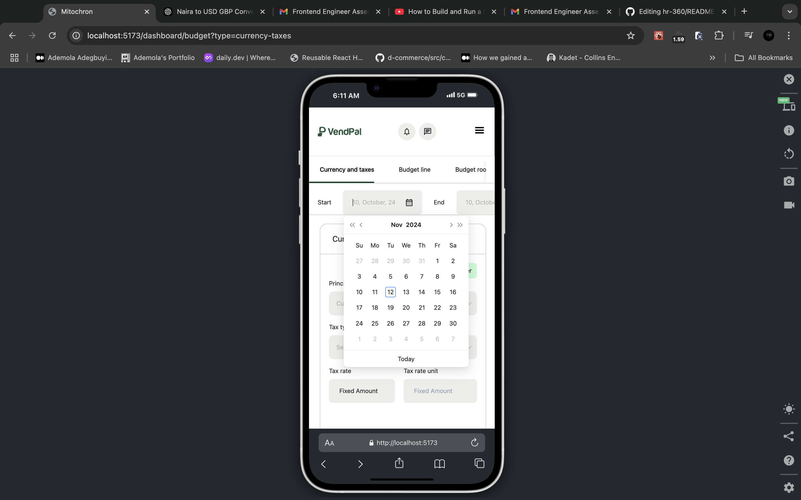
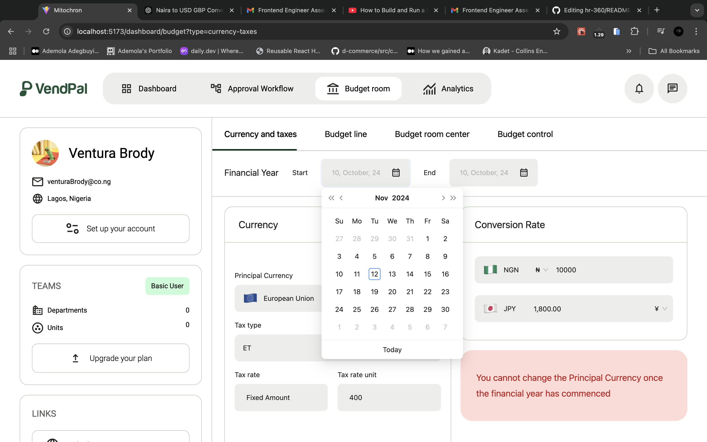

### Mitochron Frontend Assessment

#### STEPS

```
Clone the project - git clone ...
cd into project
run Yarn install || npm install
run yarn dev
```

#### PROJECT SETUP

```
Linting setup with eslint-config, prettier
Pre-commit rules with husky and lint-staged
set commit-messages with commitlint for restricted github commits
State management: Zustand (simple light weight state management tool with improved performance and selective renders)
Styling: Tailwind CSS, AntD
Routing: React Router
```

#### TECHNOLOGIES

```
ReactJs
Tailwind
Typescript
Vite (Module Bundler)
React Router
Zustand
AntD
Framer-motion
```

[Mitochron](https://mitochron.vercel.app)






